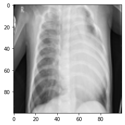

# A Machine Learning approach to classify the chest X Rays of Healthy vs Pneumonia (Corona) affected patients

Corona - COVID19 virus affects the respiratory system of healthy individual & Chest X -Ray is one of the important imaging methods to identify the corona virus. Using the introduced dataset a Deep CNN model was developed to classify healthy chest X-RAY among various pnemonia types.

## Dataset

CoronaHack -Chest X-Ray-Dataset is available in the following link. [Download](https://www.kaggle.com/datasets/praveengovi/coronahack-chest-xraydataset)

| X_ray_image_name        |                     Label                     |                                                                         Dataset_type |                   Label_2_Virus_category |                                                Label_1_Virus_category |
| ----------------------- | :-------------------------------------------: | -----------------------------------------------------------------------------------: | ---------------------------------------: | --------------------------------------------------------------------: |
| Image name of the X ray | Few image name contains Virus or Bacteria tag | It indicates X Ray - Normal or Healthy and Person affected with Pneumonia / Pnemonia | X Ray Image belongs to train or test set | It helpful for Machine learning researchers to train machine learning | Label holds the information about the pneumonia is due to Virus . Bacteria or ARDS | Label holds the information about the pneumonia (Virus . Bacteria or ARDS) & detailed classification |

### One-hot encoded lables

| Normal-nan-nan | Pnemonia-ARDS-Stress-Smoking | Pnemonia-COVID-19-Virus | Pnemonia-SARS-Virus | Pnemonia-Streptococcus-bacteria | Pnemonia-nan-Virus | Pnemonia-nan-bacteria |
| :------------: | ---------------------------: | ----------------------: | ------------------: | ------------------------------: | -----------------: | --------------------: |
|       1        |                            0 |                       0 |                   0 |                               0 |                  0 |                     0 |
|       0        |                            1 |                       0 |                   0 |                               0 |                  0 |                     0 |
|       0        |                            0 |                       1 |                   0 |                               0 |                  0 |                     0 |
|       0        |                            0 |                       0 |                   1 |                               0 |                  0 |                     0 |
|       0        |                            0 |                       0 |                   0 |                               1 |                  0 |                     0 |
|       0        |                            0 |                       0 |                   0 |                               0 |                  1 |                     0 |
|       0        |                            0 |                       0 |                   0 |                               0 |                  0 |                     1 |

An X-Ray sample of chest resized to 100x100 pixels

## Model Representation

## Model Evaluation

## Results

Accuracy Score: `0.6858475894245724`
